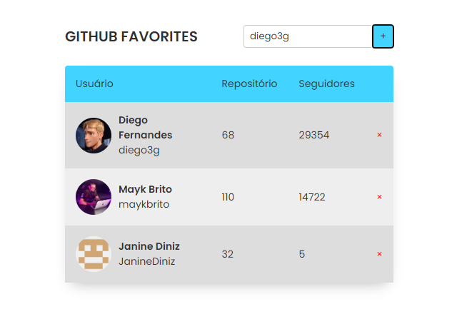

<h1 align="center"> Github Favorites </h1>

Projeto do treinamento da Rocketseat para ensino de tecnologias WEB.

  <a href="#-tecnologias">Tecnologias</a>&nbsp;&nbsp;&nbsp;|&nbsp;&nbsp;&nbsp;
  <a href="#-projeto">Projeto</a>&nbsp;&nbsp;&nbsp;|&nbsp;&nbsp;&nbsp;
  <a href="#-layout">Layout</a>&nbsp;&nbsp;&nbsp;|&nbsp;&nbsp;&nbsp;
  <a href="#memo-licença">Licença</a>

  

 

  

## 🚀 Tecnologias

Esse projeto foi desenvolvido com as seguintes tecnologias:

- HTML, CSS e JavaScript
- Git e Github
- Figma

## 💻 Projeto

O projeto é um site em que buscamos um perfil no github pela API e esse fica listado como favorito na tabela (imagem de perfil, nome do usuário e perfil, repositórios e número de seguidores). É possível remover os perfis.

Esse projeto é um estudo dos conceitos de JavaScript:
- Tabelas
- Pseudo Classes e Selector
- Modularização de código;
- Classes;
- Mapeamento de rotas;
- Assíncrono e promises;
- Prática de manipulação de DOM (criação de elementos html).

## 🔖 Layout

Você pode visualizar o layout do projeto através [DESSE LINK](https://www.figma.com/file/SzQA07HwmSPj4hOYgu1Pps/%5BDesafios-Explorer%5D-GitFav/duplicate). É necessário ter conta no [Figma](https://figma.com) para acessá-lo.

## :memo: Licença